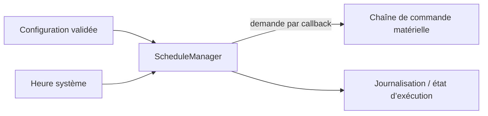

# AquaLook Engineering Reference — Scheduler

- Version documentaire : 1.0
- Statut : référence initiale
- Dernière consolidation : 2026-07-27
- Sources : `AGENTS.md`, checkpoints validés, code du dépôt
- Composant : `ScheduleManager`
- Maturité : D3

## Mission

Le Scheduler interprète les programmes persistés, calcule leurs occurrences et demande l’activation ou l’arrêt d’une zone par le mécanisme de commande prévu. Il ne pilote jamais directement le matériel.

## Responsabilités

- charger les programmes actifs ;
- interpréter jours fixes, intervalles, heures et durées ;
- détecter les occurrences à déclencher ;
- suivre l’exécution temporelle ;
- demander un changement d’état par callback ;
- recalculer les échéances après chargement ou modification.

## Responsabilités exclues

- accès direct au contrôleur de relais ;
- écriture directe dans la NVS ;
- décision de présentation Web ou LCD ;
- dépendance obligatoire à Internet.

## Architecture

Le callback matériel est câblé depuis `main.cpp`. Cette séparation est un invariant du projet.

## Gestion du temps

Avant synchronisation NTP, les événements de démarrage peuvent être ordonnés par `millis()`. Les déclenchements calendaires utilisent l’heure absolue lorsqu’elle est disponible. La synchronisation NTP est réalisée après connexion Wi-Fi puis périodiquement selon la configuration du projet ; la référence historique documentée est six heures.

## Modes dégradés

- perte Wi-Fi : maintien du fonctionnement local ;
- perte NTP après synchronisation : poursuite sur l’horloge locale ;
- configuration invalide : rejet par le propriétaire de la configuration ;
- matériel indisponible : échec de la demande remonté sans pilotage direct de secours par le Scheduler.

## Invariants

### INV-SCH-001

Un programme inactif ne déclenche aucune exécution.

### INV-SCH-002

Le Scheduler ne manipule jamais directement les sorties physiques.

### INV-SCH-003

La durée maximale de sécurité reste imposée par la chaîne de commande.

### INV-SCH-004

La perte d’un service distant ne bloque pas les programmes locaux.

## Interfaces

### Interfaces internes

- chargement et rechargement de la planification ;
- callback de demande d’état matériel ;
- consultation de l’état et des échéances par les interfaces du système.

Les signatures C++ exactes doivent être extraites du code lors de la consolidation D4.

### Interfaces HTTP associées confirmées historiquement

| URL | Méthode | Usage |
|---|---|---|
| `/programmes` | GET | Affichage de la gestion des programmes |
| `/save` | POST | Enregistrement des données depuis l’interface historique |
| `/etat` | GET | Consultation de l’état d’exécution |
| `/status` | GET | État synthétique du système |

La correspondance exacte des routes avec le firmware courant doit être vérifiée à chaque checkpoint.

## Tests attendus

- calcul des jours actifs ;
- déclenchement à l’heure prévue ;
- absence de double déclenchement ;
- fin à durée prévue ;
- reprise après redémarrage ;
- fonctionnement hors ligne ;
- validation de 1 à 8 zones.

## Références

- `AGENTS.md` — relais, persistance et validation fonctionnelle ;
- `docs/codex/03_INVARIANTS.md` ;
- checkpoints de planification et d’Execution Shadow Runtime ;
- roadmaps relatives au moteur V4.

## Historique

### 1.0

Première consolidation du Scheduler dans le référentiel v1.0.
