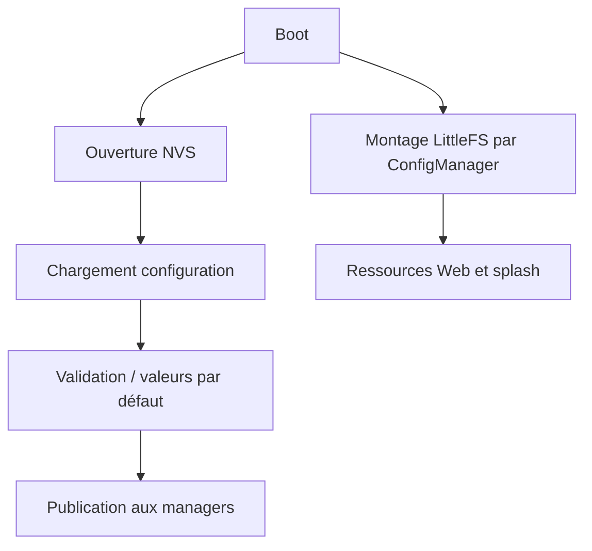

# AquaLook Engineering Reference — Configuration et persistance

- Version documentaire : 1.0
- Statut : référence initiale
- Dernière consolidation : 2026-07-27
- Sources : `AGENTS.md`, checkpoints NVS/LittleFS/SD, code du dépôt
- Composants : `ConfigManager`, NVS, LittleFS, SD
- Maturité : D3

## Mission

`ConfigManager` fournit la configuration validée aux autres composants et possède le cycle de persistance. Il est l’unique propriétaire du montage LittleFS. La configuration persistante active est stockée en NVS. LittleFS fournit principalement les ressources Web et le splash en lecture seule, hors migration historique contrôlée.

## Responsabilités

- charger la configuration ;
- appliquer les valeurs par défaut nécessaires ;
- valider les plages et la cohérence ;
- lire et écrire la NVS ;
- gérer le montage LittleFS ;
- publier une configuration cohérente ;
- préparer une migration lorsqu’un schéma change.

## Invariants

### INV-CFG-001

Une configuration consommée par le Runtime est validée.

### INV-CFG-002

Toute évolution du schéma NVS est versionnée et accompagnée d’une migration ou d’un repli explicite.

### INV-CFG-003

Les managers ne montent pas LittleFS indépendamment de `ConfigManager`.

### INV-CFG-004

Les ressources Web et le splash ne sont pas des données métier persistantes.

## Répartition actuelle des supports

| Support | Usage de référence |
|---|---|
| NVS | Configuration active et paramètres critiques |
| LittleFS | Ressources Web et splash, lecture seule en fonctionnement normal |
| microSD | Ressources volumineuses, récupération et extensions documentées par les checkpoints |
| RAM | État courant, caches et exécution volatile |

La carte SD reste optionnelle pour le démarrage minimal et le fonctionnement local essentiel.

## Séquence de chargement



## Modes dégradés

- NVS illisible : application de la stratégie de repli documentée, sans inventer de migration silencieuse ;
- LittleFS indisponible : diagnostic et interface minimale selon le firmware ;
- SD absente : maintien du cœur d’arrosage et des ressources de secours ;
- configuration partielle : rejet ou complétion contrôlée selon le schéma réellement implémenté.

## Interfaces HTTP associées

| URL | Méthode | Usage confirmé ou historique |
|---|---|---|
| `/edit` | GET | Édition de configuration dans l’interface historique |
| `/save` | POST | Enregistrement depuis l’interface historique |
| `/reset-page` | GET | Page de confirmation de réinitialisation |
| `/reset` | POST ou GET selon version | Réinitialisation contrôlée |
| `/api/display` | GET/POST | Lecture et sauvegarde de la configuration d’affichage |

La méthode exacte de `/reset` et les autres routes doivent être vérifiées dans le firmware du checkpoint ciblé.

## Validation

Après modification de `data/`, exécuter :

```text
pio run -e ProgrammeArrosage -t buildfs
```

Après modification de la persistance, vérifier : premier boot, redémarrage, conservation des valeurs, valeurs invalides, migration et retour aux valeurs sûres.

## Références

- `AGENTS.md` — sections LittleFS et Persistance ;
- `docs/codex/03_INVARIANTS.md` ;
- checkpoints de migration LittleFS vers NVS ;
- checkpoints de migration progressive des ressources Web vers SD.

## Historique

### 1.0

Première consolidation de la configuration et de la persistance.
