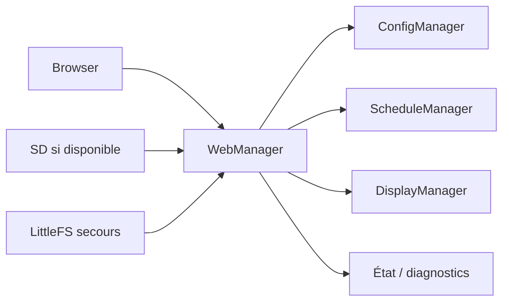
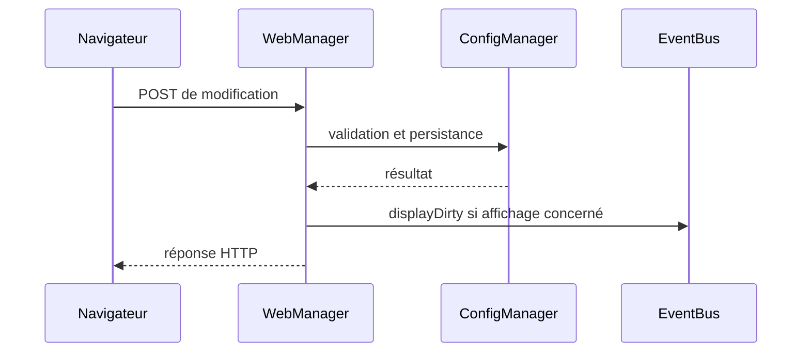

# AquaLook Engineering Reference — Web et interfaces HTTP

- Version documentaire : 1.0
- Statut : référence initiale
- Dernière consolidation : 2026-07-27
- Sources : `AGENTS.md`, checkpoints Web/SD, ressources `data/`, code du dépôt
- Composant : `WebManager`
- Maturité : D3

## Mission

`WebManager` expose l’interface locale, sert les ressources Web, reçoit les commandes HTTP et délègue leur traitement aux composants propriétaires. Il ne pilote pas directement le matériel et ne modifie pas directement la persistance.

## Contraintes

- préserver les routes existantes sauf décision explicite ;
- préserver les identifiants HTML consommés par `app.js` ;
- après une modification d’affichage, activer le mécanisme de rafraîchissement prévu, notamment `EventBus::displayDirty` ;
- répondre au client avant un redémarrage ;
- surveiller la taille de LittleFS après changement de `data/` ;
- considérer le verrouillage administrateur actuel comme visuel, et non comme une authentification forte.

## Architecture

## Routes confirmées par l’historique du projet

| URL | Méthode historique | Usage |
|---|---|---|
| `/` | GET | Page principale |
| `/edit` | GET | Édition de configuration |
| `/etat` | GET | État courant |
| `/programmes` | GET | Gestion des programmes |
| `/save` | POST | Enregistrement de configuration |
| `/reset-page` | GET | Confirmation de réinitialisation |
| `/reset` | à vérifier | Réinitialisation contrôlée |
| `/etat-led` | GET | État de l’indicateur ou sortie associée |
| `/status` | GET | État synthétique |
| `/site.css` | GET | Feuille de style historique |
| `/api/display` | GET | Lecture de la configuration d’affichage |
| `/api/display` | POST | Sauvegarde de la configuration d’affichage |

Cette liste doit être régénérée depuis les déclarations de routes du firmware à chaque consolidation majeure. Les routes non confirmées ne sont pas ajoutées au référentiel.

## Ressources statiques

Les ressources sont servies depuis LittleFS ou depuis la carte SD selon l’état de migration. Le démarrage, le portail captif et le diagnostic minimal doivent rester disponibles sans carte SD.

## Séquence de modification

## Sécurité actuelle

Le verrouillage administrateur côté navigateur ne constitue pas une authentification. Une exposition hors du réseau local exige une authentification réelle, des sessions, une validation stricte des entrées et un canal sécurisé selon l’architecture cybersécurité.

## Modes dégradés

- SD absente : ressources de secours depuis LittleFS ;
- Wi-Fi station indisponible : portail captif selon la logique existante ;
- ressource absente : réponse d’erreur sans blocage du Runtime ;
- redémarrage requis : réponse envoyée avant reboot.

## Tests

- chargement de chaque URL ;
- cohérence des IDs HTML et de `app.js` ;
- GET/POST de `/api/display` ;
- fonctionnement avec et sans SD ;
- portail captif ;
- taille et compilation LittleFS ;
- absence de duplication HTML/CSS/JS.

## Références

- `AGENTS.md` — sections Web, LittleFS et validation ;
- checkpoints de migration Web vers SD ;
- `docs/security/CYBERSECURITY_ARCHITECTURE.md` ;
- code de déclaration des routes dans `WebManager`.

## Historique

### 1.0

Première consolidation des interfaces HTTP confirmées.
