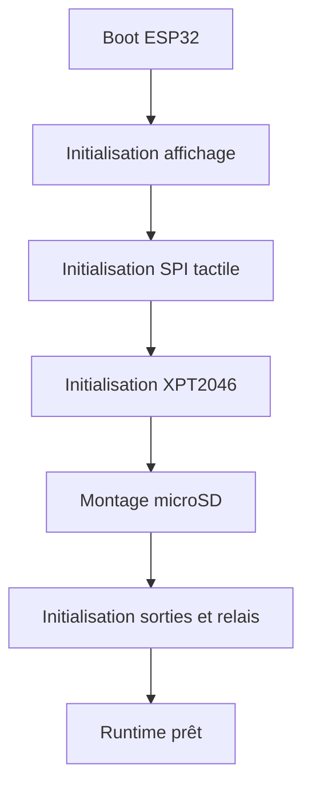

# AquaLook Engineering Reference — Plateforme matérielle

- Version documentaire : 1.0
- Statut : référence initiale
- Dernière consolidation : 2026-07-27
- Sources : checkpoint `CHECKPOINT_2026-07-13_MAIN_STEP6_CLOSED.md`, `AGENTS.md`, code du dépôt
- Composants : ESP32 CYD, écran TFT, tactile XPT2046, microSD, bus SPI
- Maturité : D3

## Objet

Ce document décrit la plateforme matérielle validée à la clôture de l’étape 6. Il ne remplace pas les schémas électriques ni les fichiers de configuration des bibliothèques.

## Plateforme de référence

La plateforme utilisée par le firmware principal est une carte ESP32 de type CYD intégrant :

- un écran TFT 320 × 240 ;
- un contrôleur tactile XPT2046 ;
- un lecteur microSD ;
- une connectivité Wi-Fi 2,4 GHz ;
- une mémoire interne sans PSRAM sur la variante de référence.

Les références exactes du contrôleur TFT et les broches restent définies par la configuration de compilation et le code du commit ciblé.

## Sous-systèmes validés

| Sous-système | État validé au checkpoint |
|---|---|
| ESP32 et firmware V4 | compilation et upload réussis |
| LCD | affichage fonctionnel |
| tactile XPT2046 | fonctionnel sur bus VSPI séparé |
| microSD | ressources Web servies avec fallback LittleFS |
| relais | fonctionnement matériel validé |
| Wi-Fi | serveur Web et NTP fonctionnels |

## Bus SPI

L’écran, le tactile et la carte SD utilisent des interfaces SPI dont la coexistence doit être explicitement maîtrisée.

Le tactile XPT2046 utilise un bus VSPI séparé. L’initialisation de ce bus a fait l’objet d’une correction validée durant l’étape 6. Le niveau de log ESP est restauré après l’appel d’initialisation tactile afin de couvrir le warning APB parasite observé pendant cette phase.

## Séquence d’initialisation matérielle

L’ordre exact est défini par le code. Le principe de sécurité est que les sorties restent dans un état sûr tant que l’initialisation n’est pas terminée.

## Contraintes

- GPIO disponibles limités ;
- absence de PSRAM sur la variante de référence ;
- partage ou proximité de plusieurs périphériques SPI ;
- dépendance de l’interface locale à l’écran et au tactile ;
- nécessité d’un comportement local autonome sans Internet ;
- ressources LittleFS proches de la limite de partition historique.

## Modes dégradés

### microSD indisponible

Les ressources Web sont recherchées dans LittleFS. Le logo dispose en complément d’un fallback SVG embarqué dans le firmware.

### tactile indisponible

Le Runtime et le serveur Web continuent de fonctionner. Le diagnostic doit signaler l’indisponibilité de l’interface locale tactile.

### écran indisponible

Le contrôle par interface Web reste disponible si le réseau est opérationnel.

### réseau indisponible

L’arrosage local, la planification et les sécurités matérielles restent prioritaires.

## Invariants

### INV-HW-001

Les relais sont initialisés dans un état sûr avant l’activation du Runtime.

### INV-HW-002

Le tactile conserve son bus SPI séparé tant qu’aucune validation matérielle n’autorise une autre topologie.

### INV-HW-003

Une panne d’écran, de tactile ou de microSD ne doit pas contourner les sécurités de commande des relais.

### INV-HW-004

Les résultats matériels ne sont jamais déclarés validés sans essai réel.

## Tests de référence

- compilation `ProgrammeArrosage_legacy` ;
- compilation et upload `ProgrammeArrosage_v4` ;
- vérification LCD ;
- vérification tactile ;
- test des relais sur une zone, durée courte, sous surveillance ;
- vérification du service des ressources SD puis des fallbacks ;
- contrôle du démarrage sans activation intempestive.

## Références

- `docs/checkpoints/CHECKPOINT_2026-07-13_MAIN_STEP6_CLOSED.md` ;
- `AGENTS.md` — affichage, relais, validation matérielle ;
- configuration TFT_eSPI et fichiers matériels du commit ciblé.

## Historique

### 1.0

Première consolidation de la plateforme matérielle validée à la clôture de l’étape 6.