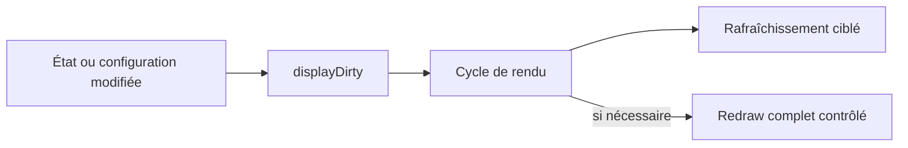

# AquaLook Engineering Reference — Affichage et tactile

- Version documentaire : 1.0
- Statut : référence initiale
- Dernière consolidation : 2026-07-27
- Sources : checkpoint `CHECKPOINT_2026-07-13_MAIN_STEP6_CLOSED.md`, `AGENTS.md`, code du dépôt
- Composants : DisplayManager, TFT, XPT2046, sprites, EventBus
- Maturité : D3

## Mission

La couche d’affichage restitue l’état du système sur l’écran local. La couche tactile acquiert les interactions de l’utilisateur et les transmet aux gestionnaires d’interface. Elles ne contiennent pas de logique métier d’arrosage.

## Responsabilités

### Affichage

- initialiser le TFT ;
- rendre les vues et informations système ;
- appliquer les paramètres d’affichage ;
- limiter les redraws complets ;
- préserver la lisibilité pendant les opérations réseau et NTP ;
- prendre en compte le signal `EventBus::displayDirty` après une modification pertinente.

### Tactile

- initialiser le bus SPI dédié ;
- initialiser le XPT2046 ;
- lire les coordonnées ;
- appliquer la calibration ;
- transmettre les événements tactiles à l’interface.

## Invariants

### INV-DSP-001

`fillScreen()` n’est pas appelé hors du chemin de redraw complet prévu.

### INV-DSP-002

Le tactile conserve son bus SPI séparé.

### INV-DSP-003

Les paramètres d’affichage modifiables à chaud restent appliqués sans redémarrage lorsqu’un mécanisme hot-reload existe.

### INV-DSP-004

Une synchronisation NTP ne déclenche pas à elle seule un redraw complet de l’écran.

### INV-DSP-005

Les polices déjà fournies par TFT_eSPI ne sont pas ajoutées par des includes GFXFF séparés.

## Séquence de rafraîchissement

La réduction des redraws a été validée pendant l’étape 6 afin de limiter les blocages et les artefacts.

## Initialisation tactile

La séquence validée couvre l’initialisation du bus tactile puis l’appel à `_touch.begin(_touchSPI)`. Le niveau de log ESP est restauré après cette phase pour englober le warning APB parasite observé lors de l’initialisation.

## Interfaces internes

- signal de mise à jour d’affichage via l’EventBus ;
- accès aux paramètres d’affichage fournis par la configuration ;
- événements tactiles transformés en actions d’interface ;
- consultation des états Runtime sans accès direct au matériel de relais.

Les signatures exactes doivent être extraites du code lors du passage à D4.

## Interfaces HTTP associées

Les routes confirmées relatives à l’affichage sont inventoriées dans `09_WEB_AND_HTTP_INTERFACES.md`. Après un POST qui modifie l’affichage, le mécanisme `EventBus::displayDirty` doit être positionné.

## Modes dégradés

### écran indisponible

Le serveur Web et le moteur d’arrosage continuent de fonctionner.

### tactile indisponible

L’interface locale perd l’entrée tactile, mais le Web demeure disponible si le réseau fonctionne.

### ralentissement Runtime

Le profiler runtime qualifie les pauses en temps mural. Un ralentissement ne doit pas être attribué à l’affichage sans mesure du composant actif et du contexte d’ordonnancement.

## Tests

- démarrage et splash ;
- rendu principal ;
- rafraîchissement après changement de configuration ;
- absence de redraw complet pendant la synchronisation NTP ;
- calibration et coordonnées tactiles ;
- fonctionnement du tactile après initialisation SPI ;
- vérification des modes avec Web disponible et écran ou tactile indisponible.

## Références

- `docs/checkpoints/CHECKPOINT_2026-07-13_MAIN_STEP6_CLOSED.md` ;
- `AGENTS.md` — affichage et Web ;
- `09_WEB_AND_HTTP_INTERFACES.md` ;
- fichiers DisplayManager, EventBus et configuration tactile du commit ciblé.

## Historique

### 1.0

Première consolidation de l’affichage et du tactile validés à la clôture de l’étape 6.