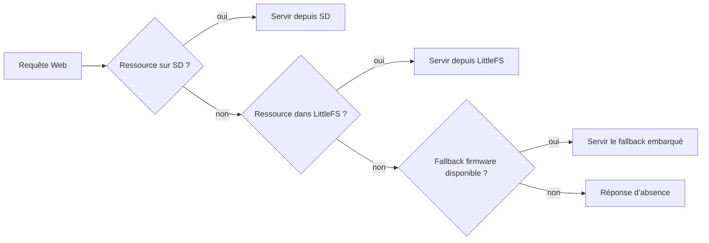

# AquaLook Engineering Reference — microSD et ressources statiques

- Version documentaire : 1.0
- Statut : référence initiale
- Dernière consolidation : 2026-07-27
- Sources : checkpoint `CHECKPOINT_2026-07-13_MAIN_STEP6_CLOSED.md`, `AGENTS.md`, code du dépôt
- Composants : microSD, LittleFS, `SdStaticHandler`, ressources Web, logo
- Maturité : D3

## Mission

La chaîne de ressources statiques fournit au serveur Web les fichiers nécessaires à l’interface tout en maintenant des fallbacks compatibles avec l’état historique du projet.

## Ordre de résolution validé

Pour les ressources prises en charge par `SdStaticHandler`, le système applique une résolution progressive :

Le logo dispose d’un fallback validé SD / LittleFS / SVG firmware.

## Responsabilités

- monter et qualifier la carte microSD ;
- servir les ressources présentes sur la carte ;
- basculer vers LittleFS lorsqu’une ressource est absente ;
- utiliser un fallback firmware uniquement lorsqu’il existe explicitement ;
- fournir des diagnostics de montage et de résolution ;
- ne pas empêcher le fonctionnement essentiel lorsque la SD est absente.

## Répartition des supports

| Support | Usage de référence |
|---|---|
| NVS | configuration active et paramètres critiques |
| LittleFS | ressources Web et splash historiques, en lecture seule |
| microSD | ressources volumineuses et ressources Web externes |
| firmware | fallback minimal explicitement prévu |

## Invariants

### INV-SD-001

L’absence de microSD ne bloque pas le moteur d’arrosage.

### INV-SD-002

LittleFS reste monté par `ConfigManager` uniquement.

### INV-SD-003

Le contenu de `data/` ne comprend ni sauvegardes, ni patchs, ni documentation, ni fichiers temporaires.

### INV-SD-004

Toute modification de `data/` impose une validation `buildfs`.

### INV-SD-005

Un fallback n’est documenté comme disponible que s’il est confirmé dans le code ou un checkpoint validé.

## Interfaces fichiers

Les chemins exacts des ressources doivent être extraits du code et de la carte SD de référence lors du passage à D4. Le référentiel conserve au minimum :

- la racine des ressources Web ;
- les chemins du logo et du splash ;
- les correspondances URL → fichier ;
- le support prioritaire et les fallbacks ;
- le type MIME servi.

## Interfaces HTTP

Les URL réellement présentes sont inventoriées dans `09_WEB_AND_HTTP_INTERFACES.md`. Une ressource statique doit conserver les URL et identifiants attendus par l’interface existante sauf décision documentée.

## Modes dégradés

### SD absente ou non montée

- journalisation de l’état ;
- recherche dans LittleFS ;
- utilisation des fallbacks firmware disponibles ;
- maintien des fonctions locales essentielles.

### ressource absente de tous les supports

Le serveur retourne une réponse cohérente et journalise l’absence lorsque celle-ci est significative.

### espace LittleFS contraint

Toute évolution Web doit inclure un bilan de taille. Le déplacement de ressources vers SD ne justifie pas la suppression immédiate d’un fallback validé.

## Validation

- démarrage avec SD valide ;
- démarrage sans SD ;
- ressource présente sur SD ;
- ressource absente de SD mais présente dans LittleFS ;
- logo absent de SD et de LittleFS avec fallback SVG firmware ;
- contrôle des types MIME ;
- `pio run -e ProgrammeArrosage -t buildfs` après modification de `data/`.

## Références

- `docs/checkpoints/CHECKPOINT_2026-07-13_MAIN_STEP6_CLOSED.md` ;
- `AGENTS.md` — LittleFS, Web et validation ;
- `07_CONFIGURATION_AND_PERSISTENCE.md` ;
- `09_WEB_AND_HTTP_INTERFACES.md` ;
- implémentation `SdStaticHandler` du commit ciblé.

## Historique

### 1.0

Première consolidation de la microSD, des ressources statiques et des fallbacks validés.