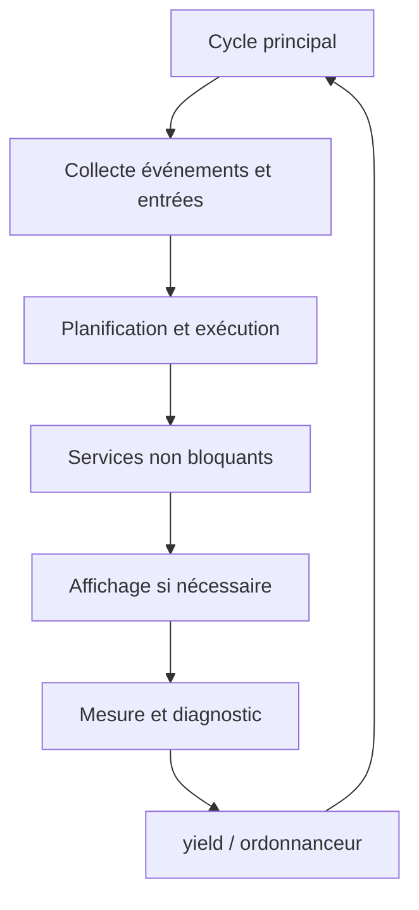

# AquaLook Engineering Reference — Runtime et profiling

- Version documentaire : 1.0
- Statut : référence initiale
- Dernière consolidation : 2026-07-27
- Sources : checkpoint `CHECKPOINT_2026-07-13_MAIN_STEP6_CLOSED.md`, code du dépôt
- Composants : boucle principale, Runtime V4, profiler, EventLog
- Maturité : D3

## Mission

Le Runtime coordonne les composants actifs du firmware. Le profiler mesure le temps mural observé autour des traitements afin d’identifier les pauses, blocages et dérives de cadence.

## État validé

À la clôture de l’étape 6 :

- le backend V4 est fonctionnel ;
- le fallback legacy est conservé ;
- la météo fonctionne de manière non bloquante ;
- les redraws ont été réduits ;
- le journal EventLog est horodaté ;
- le profiler qualifie explicitement ses mesures en temps mural ;
- des pauses proches de 136 ms ont été observées ;
- ces pauses peuvent provenir de l’ordonnanceur et ne sont pas attribuées automatiquement au composant actif ;
- `yield()` reste mesuré mais est exclu des alertes de lenteur métier.

## Cycle Runtime

L’ordre exact et les composants appelés sont définis par le code du commit ciblé.

## Principes

- éviter les traitements réseau bloquants ;
- réduire les redraws complets ;
- conserver les fonctions essentielles locales lorsque les services distants sont indisponibles ;
- mesurer avant d’attribuer une lenteur ;
- distinguer temps CPU, temps mural et temps cédé à l’ordonnanceur ;
- ne pas masquer une pause sous prétexte qu’elle se produit autour de `yield()`.

## Profiler

Le profiler produit une mesure de temps mural. Une durée inclut potentiellement :

- le temps d’exécution du composant ;
- les interruptions ;
- les changements de tâche ;
- les délais introduits par l’ordonnanceur ;
- les attentes système.

Une mesure longue n’est donc pas une preuve suffisante qu’un composant est intrinsèquement lent.

## Traitement de `yield()`

`yield()` est conservé dans les mesures de diagnostic pour observer le cycle complet. Il est exclu des alertes de lenteur métier afin d’éviter de classer comme anomalie applicative un délai lié à l’ordonnanceur.

## Invariants

### INV-RUN-001

Les services optionnels ne bloquent pas la planification et la sécurité des relais.

### INV-RUN-002

Une alerte de performance distingue le composant mesuré du temps mural observé.

### INV-RUN-003

Les optimisations de rendu ne doivent pas supprimer un rafraîchissement fonctionnel requis.

### INV-RUN-004

Le fallback legacy reste présent tant que sa suppression n’est pas explicitement validée.

## Interfaces de diagnostic

Les sorties exactes du profiler doivent être extraites du code lors du passage à D4. Elles doivent identifier au minimum :

- le composant ou segment mesuré ;
- la durée murale ;
- le seuil d’alerte ;
- le contexte Runtime ;
- l’exclusion éventuelle des alertes métier.

Les routes Web de diagnostic confirmées sont recensées dans `09_WEB_AND_HTTP_INTERFACES.md`.

## Tests

- cycle Runtime sans réseau ;
- météo non bloquante ;
- synchronisation NTP sans redraw complet ;
- mesure du profiler pendant charge Web ;
- mesure autour de `yield()` ;
- confirmation qu’une pause ne provoque pas de défaut de durée maximale des relais ;
- validation de l’affichage et du tactile pendant les diagnostics.

## Risques

- attribution erronée d’une pause à un composant actif ;
- instrumentation trop lourde modifiant le comportement observé ;
- logs trop abondants perturbant le temps réel ;
- optimisation d’affichage masquant une mise à jour nécessaire.

## Références

- `docs/checkpoints/CHECKPOINT_2026-07-13_MAIN_STEP6_CLOSED.md` ;
- `10_TIME_AND_EVENTLOG.md` ;
- `13_DISPLAY_AND_TOUCH.md` ;
- profiler et boucle Runtime du commit ciblé.

## Historique

### 1.0

Première consolidation du Runtime non bloquant et du profiler qualifié en temps mural.