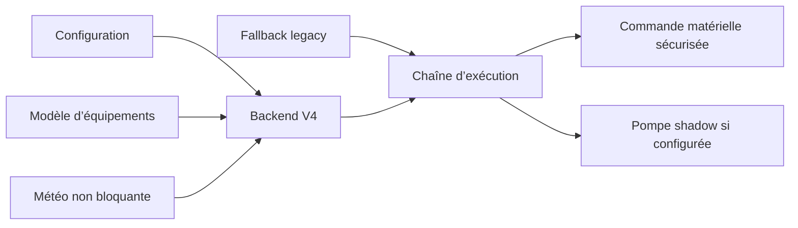

# AquaLook Engineering Reference — Backend V4, modèle d’équipements et météo

- Version documentaire : 1.0
- Statut : référence initiale
- Dernière consolidation : 2026-07-27
- Sources : checkpoint `CHECKPOINT_2026-07-13_MAIN_STEP6_CLOSED.md`, code du dépôt
- Composants : backend V4, fallback legacy, modèle d’équipements transitoire, pompe shadow, météo
- Maturité : D2

## Objet

Ce document consolide l’état validé du backend V4 à la clôture de l’étape 6. Il décrit uniquement les capacités confirmées et renvoie les évolutions aux roadmaps existantes.

## État validé

- backend V4 fonctionnel ;
- fallback legacy conservé ;
- modèle d’équipements transitoire opérationnel ;
- scénario pompe shadow passif disponible selon configuration ;
- météo non bloquante fonctionnelle ;
- compilation et upload de l’environnement V4 réussis ;
- essais matériels associés réussis.

## Backend V4

Le backend V4 introduit une couche d’évolution du moteur sans supprimer immédiatement les comportements legacy validés. Le choix entre chemins V4 et legacy dépend de la configuration et du code du commit ciblé.

### Invariants

#### INV-V4-001

Le fallback legacy est conservé tant que sa suppression n’est pas validée explicitement.

#### INV-V4-002

Un équipement transitoire ne contourne pas la chaîne de commande matérielle et les sécurités de durée.

#### INV-V4-003

Une capacité V4 n’est déclarée active que si son chemin d’exécution est câblé et testé.

## Modèle d’équipements transitoire

Le modèle d’équipements permet de représenter des fonctions matérielles sans figer immédiatement l’architecture cible complète.

Les éléments consolidés sont :

- identification d’équipements ;
- association à une fonction ;
- utilisation par le backend V4 ;
- coexistence avec les structures legacy ;
- préparation de scénarios tels que la pompe shadow.

Les structures exactes, identifiants et relations doivent être extraits du code lors du passage à D3.

## Pompe shadow passive

Le scénario pompe shadow est disponible selon configuration. Son rôle est d’accompagner l’exécution sans introduire un pilotage autonome non validé.

Une pompe shadow passive :

- dépend de l’état d’exécution configuré ;
- ne crée pas seule un programme ;
- ne contourne pas le RelayManager ;
- conserve les sécurités de durée maximale ;
- produit des diagnostics exploitables.

## Météo non bloquante

La météo est intégrée sous une forme streaming ou progressive afin de ne pas immobiliser le Runtime pendant une opération réseau.

### Invariants météo

#### INV-WEA-001

L’indisponibilité de la météo ne bloque pas le moteur local.

#### INV-WEA-002

Une opération météo ne provoque pas de traitement réseau long dans la boucle critique.

#### INV-WEA-003

Les données météo ne commandent pas directement les relais.

## Séquence simplifiée

## Modes dégradés

### météo indisponible

Le système conserve son fonctionnement local selon les règles déjà validées. L’erreur est journalisée sans blocage.

### configuration V4 incomplète

Le système applique le repli explicitement prévu. Aucun fallback ne doit être supposé s’il n’est pas présent dans le code.

### équipement absent

La fonction associée est indisponible ou dégradée. Les autres fonctions restent actives lorsqu’elles ne dépendent pas de cet équipement.

## Tests de référence

- compilation V4 ;
- upload V4 ;
- démarrage avec fallback legacy ;
- fonctionnement du modèle transitoire ;
- scénario pompe shadow selon configuration ;
- météo disponible ;
- météo indisponible ;
- absence de blocage du Runtime ;
- vérification des relais et de la durée maximale.

## Références

- `docs/checkpoints/CHECKPOINT_2026-07-13_MAIN_STEP6_CLOSED.md` ;
- `06_SCHEDULER.md` ;
- `08_RELAY_AND_EQUIPMENT_CONTROL.md` ;
- `15_RUNTIME_AND_PROFILING.md` ;
- roadmaps V4 et modèle d’équipements existantes.

## Historique

### 1.0

Première consolidation du backend V4, du modèle d’équipements transitoire, de la pompe shadow et de la météo non bloquante.