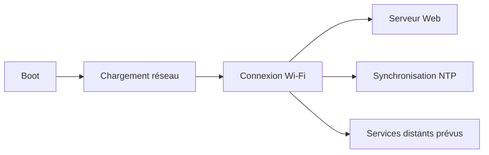

# AquaLook Engineering Reference — Réseau et Wi-Fi

- Version documentaire : 1.0
- Statut : référence initiale
- Dernière consolidation : 2026-07-27
- Sources : checkpoints validés, `AGENTS.md`, code du dépôt
- Composants : Wi-Fi, point d’accès, DNS, NTP, serveur Web
- Maturité : D3

## Mission

La couche réseau fournit la connectivité locale nécessaire à l’interface Web, à la synchronisation NTP et aux futurs services distants. Le moteur d’arrosage reste autonome lorsque le réseau est indisponible.

## Capacités validées

- connexion Wi-Fi locale ;
- serveur Web opérationnel ;
- synchronisation NTP après connexion ;
- fonctionnement local maintenu en cas de perte Internet ;
- portail ou point d’accès de secours selon la configuration historique du projet.

## Séquence générale

Le démarrage du moteur d’arrosage ne doit pas dépendre de la réussite des étapes réseau.

## États

- `DOWN` : interface indisponible ;
- `CONNECTING` : tentative en cours ;
- `CONNECTED` : adresse IP obtenue ;
- `DEGRADED` : réseau local présent mais service externe indisponible ;
- `AP_RECOVERY` : mode de récupération lorsqu’il est explicitement activé.

Les noms exacts des états C++ doivent être extraits du code lors du passage à D4.

## Interfaces exposées

### Protocoles et services confirmés

| Interface | Usage |
|---|---|
| Wi-Fi 2,4 GHz | accès réseau local |
| HTTP | interface Web actuelle |
| NTP | synchronisation temporelle |
| DNS / portail captif | configuration ou récupération selon le mode actif |

Les ports, hôtes et routes HTTP sont recensés dans `09_WEB_AND_HTTP_INTERFACES.md`. Les futurs ports MQTT, HTTPS et VPS restent documentés dans leurs roadmaps tant qu’ils ne sont pas implémentés.

## Reconnexion

Une perte Wi-Fi entraîne :

1. journalisation de la perte ;
2. maintien de l’arrosage local ;
3. tentatives de reconnexion bornées et non bloquantes ;
4. nouvelle synchronisation NTP après stabilisation de la connexion ;
5. réactivation des services réseau disponibles.

## Modes dégradés

### Wi-Fi absent

Le Scheduler, les relais, les sécurités et l’interface locale LCD continuent de fonctionner.

### Internet absent mais LAN disponible

L’interface Web locale reste accessible. NTP et services externes peuvent être indisponibles.

### Service distant indisponible

L’indisponibilité d’un service ne doit pas provoquer de boucle bloquante ni épuiser les sockets ou le heap.

## Sécurité

- aucun mot de passe universel par défaut ;
- identifiants propres à l’installation ;
- point d’accès de récupération temporaire, protégé et journalisé ;
- limitation des tentatives ;
- aucune donnée secrète dans les logs ;
- services inutiles désactivés.

## Invariants

### INV-NET-001

Le fonctionnement local essentiel ne dépend pas du réseau.

### INV-NET-002

Les reconnexions sont non bloquantes et bornées.

### INV-NET-003

Une reconnexion réussie déclenche la reprise contrôlée des services dépendants.

### INV-NET-004

Un mode de récupération réseau ne constitue pas une porte dérobée permanente.

## Tests

- boot sans point d’accès disponible ;
- connexion normale ;
- perte puis retour du Wi-Fi ;
- LAN sans Internet ;
- échec NTP ;
- fonctionnement du Scheduler pendant l’indisponibilité ;
- absence de fuite mémoire lors de reconnexions répétées.

## Références

- `docs/engineering/09_WEB_AND_HTTP_INTERFACES.md` ;
- `docs/engineering/10_TIME_AND_EVENTLOG.md` ;
- `docs/security/CYBERSECURITY_ARCHITECTURE.md` ;
- checkpoints de clôture de l’étape 6.

## Historique

### 1.0

Première consolidation du réseau et du Wi-Fi.