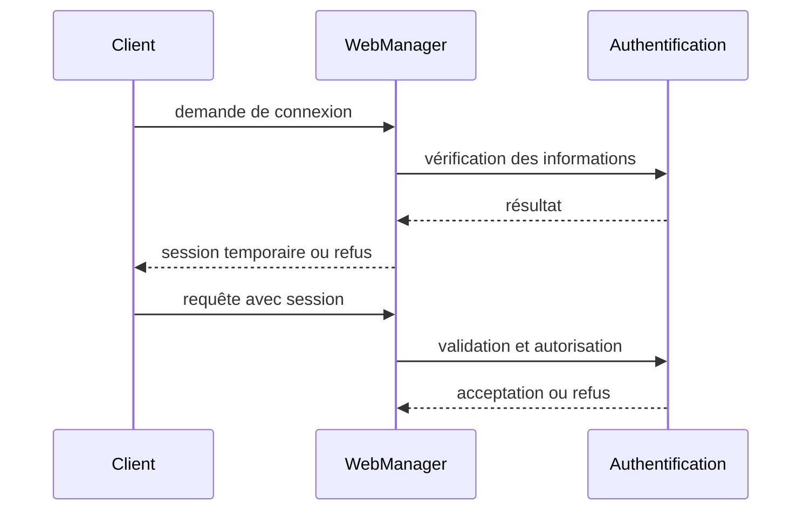

# AquaLook Engineering Reference — HTTPS et sessions

- Version documentaire : 0.7
- Statut : préliminaire, architecture de sécurité
- Dernière consolidation : 2026-07-27
- Sources : `AGENTS.md`, architecture cybersécurité, checkpoints Web
- Composants : WebManager, authentification, sessions, TLS
- Maturité : D2

## Objet

Ce document distingue le service HTTP actuellement validé de l’architecture HTTPS et sessions à mettre en place. Aucun mécanisme futur n’est présenté comme implémenté.

## État actuel confirmé

- serveur Web local fonctionnel ;
- routes historiques inventoriées dans `09_WEB_AND_HTTP_INTERFACES.md` ;
- verrouillage administrateur actuel principalement visuel côté navigateur ;
- absence d’authentification forte confirmée par `AGENTS.md` et le registre des risques.

Le verrouillage visuel ne protège pas les routes administratives contre un client HTTP direct.

## Architecture cible référencée

La cible prévoit :

- HTTPS lorsque les contraintes mémoire et certificats sont maîtrisées ;
- authentification réelle côté serveur ;
- session aléatoire, expirante et révocable ;
- autorisation distincte de l’authentification ;
- protection des actions sensibles ;
- journalisation des succès, refus et expirations.

## Cycle de session cible

## Interfaces exposées

Les URL réellement présentes restent listées dans `09_WEB_AND_HTTP_INTERFACES.md`.

Les routes de connexion, déconnexion, renouvellement et administration ne doivent être ajoutées à ce document qu’après extraction du code et validation. Les noms proposés dans les conversations ne constituent pas une interface officielle.

## Exigences de session

- identifiant imprévisible ;
- durée de vie bornée ;
- invalidation lors du changement de mot de passe ou d’identité ;
- limitation du nombre de sessions ;
- aucune session dans une URL ;
- cookie protégé si cette technologie est retenue ;
- protection CSRF pour les requêtes modifiant l’état ;
- refus en sécurité lorsque l’heure ou le stockage nécessaire est indisponible.

## TLS et contraintes ESP32

Le déploiement HTTPS doit être validé avec :

- heap libre avant et après négociation ;
- plus grand bloc contigu ;
- nombre de connexions simultanées ;
- taille et rotation des certificats ;
- comportement pendant un arrosage actif ;
- temps de réponse ;
- reprise après échec TLS.

## Modes dégradés

### HTTPS indisponible

Aucune ouverture automatique d’un accès distant non protégé. Le fonctionnement local essentiel reste actif.

### Heure absolue indisponible

Les contrôles dépendant de l’expiration ou des certificats appliquent une politique explicite et restrictive.

### Stockage de session indisponible

Les actions administratives sont refusées plutôt que traitées sans authentification.

## Risques associés

- `SEC-001` : administration locale non authentifiée fortement ;
- `SEC-010` : épuisement du heap ou des sockets ;
- `SEC-011` : secrets dans les journaux ;
- `SEC-014` : horloge incorrecte.

## Invariants

### INV-HTTPS-001

Une action sensible n’est jamais autorisée par une vérification uniquement exécutée dans le navigateur.

### INV-HTTPS-002

Une session est expirante et révocable.

### INV-HTTPS-003

Aucun secret ou jeton complet n’est journalisé.

### INV-HTTPS-004

L’ajout de TLS ne doit pas compromettre les sécurités locales ni le Runtime.

## Validation avant passage à D3

- routes réelles extraites du code ;
- authentification testée positivement et négativement ;
- expiration et révocation testées ;
- consommation mémoire mesurée ;
- tests de connexions simultanées ;
- absence de secrets dans les logs.

## Références

- `docs/engineering/09_WEB_AND_HTTP_INTERFACES.md` ;
- `docs/security/CYBERSECURITY_ARCHITECTURE.md` ;
- `docs/security/SECURITY_RISK_REGISTER.md` ;
- `AGENTS.md`.

## Historique

### 0.7

Première consolidation séparant l’état HTTP actuel de la cible HTTPS et sessions.