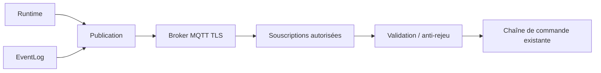

# AquaLook Engineering Reference — MQTT

- Version documentaire : 0.6
- Statut : préliminaire, non implémenté comme service de production
- Dernière consolidation : 2026-07-27
- Sources : roadmaps MQTT, architecture cybersécurité, registre des risques
- Composants : futur MQTTManager, broker, télémétrie, commandes distantes
- Maturité : D2

## Objet

Ce document fixe les limites architecturales de MQTT sans figer des topics ou schémas non confirmés par le code.

## Mission

MQTT fournira un canal de télémétrie, d’événements et de commandes distantes autorisées. Il ne remplacera ni le Scheduler local, ni les sécurités matérielles, ni l’interface Web locale.

## État

MQTT est documenté dans les roadmaps et l’architecture de sécurité. Les noms de broker, topics, QoS, schémas JSON et identifiants définitifs doivent être confirmés lors de l’implémentation.

## Architecture cible

Une commande distante ne pilote jamais directement les relais.

## Séparation des flux

- télémétrie : états, métriques et santé ;
- événements : changements et incidents ;
- commandes : demandes authentifiées et autorisées ;
- accusés : résultat réellement appliqué ;
- administration : limitée et séparée des commandes fonctionnelles.

## Interfaces exposées

Aucun topic n’est déclaré officiel dans cette version. La cartographie devra préciser pour chaque topic :

- sens publication ou souscription ;
- propriétaire ;
- payload et version de schéma ;
- QoS ;
- rétention ;
- fréquence maximale ;
- ACL ;
- caractère sensible ;
- comportement hors ligne.

## Sécurité

- TLS hors laboratoire isolé ;
- identité distincte par appareil ;
- ACL minimales par topic ;
- secrets hors Git et hors ressources SD publiques ;
- commande avec identifiant unique ;
- horodatage et durée de validité lorsque l’heure est fiable ;
- mécanisme anti-rejeu ;
- limitation de taille et de fréquence ;
- révocation individuelle.

## Reconnexion

Les tentatives sont non bloquantes et utilisent un délai progressif. La perte du broker ne perturbe pas l’arrosage local. À la reconnexion, seules les données prévues par la politique sont republiées ; aucune commande ancienne n’est rejouée.

## Last Will et état

Le Last Will, la disponibilité et les états retenus seront définis à l’implémentation. Ils devront distinguer clairement : en ligne, dégradé, indisponible et état inconnu.

## Risques associés

- `SEC-003` : commande forgée ou rejouée ;
- `SEC-007` : identité partagée entre appareils ;
- `SEC-010` : déni de service ;
- `SEC-013` : action appliquée au mauvais module ;
- `SEC-014` : horloge incorrecte.

## Invariants

### INV-MQTT-001

Le fonctionnement local est indépendant du broker.

### INV-MQTT-002

Une commande MQTT emprunte la même chaîne de validation et de commande que les interfaces locales.

### INV-MQTT-003

L’accusé reflète l’état réellement appliqué, pas seulement la réception du message.

### INV-MQTT-004

Les topics et schémas ne deviennent officiels qu’après validation et versionnement dans Git.

## Validation avant passage à D3

- broker et identité d’appareil définis ;
- topics et schémas versionnés ;
- ACL testées ;
- TLS et certificats testés ;
- anti-rejeu et expiration testés ;
- reconnexion et perte broker testées ;
- limites mémoire et fréquence mesurées.

## Références

- `docs/security/CYBERSECURITY_ARCHITECTURE.md` ;
- `docs/security/SECURITY_RISK_REGISTER.md` ;
- roadmaps MQTT et cloud ;
- `docs/engineering/18_NETWORK_AND_WIFI.md`.

## Historique

### 0.6

Première consolidation du contrat architectural MQTT.