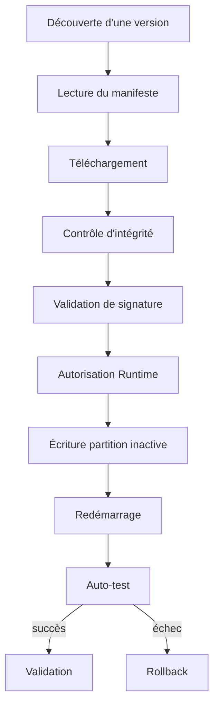

# AquaLook Engineering Reference — Mise à jour OTA

- Version documentaire : 0.6
- Statut : préliminaire, architecture avant implémentation complète
- Dernière consolidation : 2026-07-27
- Sources : roadmaps OTA, architecture cybersécurité, registre des risques
- Composants : futur OTAManager, partitions firmware, stockage temporaire, rollback
- Maturité : D2

## Mission

Le service OTA permettra de mettre à jour le firmware en conservant l’intégrité, la provenance, la possibilité de récupération et la sécurité des équipements.

## État

Les exigences OTA sont documentées, mais les routes, sources de téléchargement, formats de manifeste et procédures finales ne sont pas déclarés comme implémentés dans cette version.

## Cycle cible

## Sources possibles référencées

- upload local depuis l’interface d’administration ;
- fichier préparé sur microSD ;
- serveur HTTPS ou release GitHub ;
- signalement de disponibilité par MQTT, sans transport obligatoire du firmware par MQTT.

La source réellement retenue doit être versionnée dans une ADR.

## Interfaces exposées

Aucune URL OTA n’est déclarée officielle dans cette version. Les routes, méthodes, tailles maximales, statuts et autorisations devront être extraits du code après implémentation.

Un manifeste devra au minimum identifier : produit, matériel compatible, version, taille, SHA-256, signature, date, version minimale et notes de migration.

## Conditions d’autorisation

- aucun conflit avec une action critique ;
- alimentation et espace suffisants ;
- image compatible avec le matériel ;
- configuration utilisateur préservée ou migrée explicitement ;
- sauvegarde disponible lorsque la migration le nécessite ;
- état des relais rendu sûr avant basculement.

## Sécurité

- firmware signé ;
- validation d’intégrité avant activation ;
- transport HTTPS pour une source distante ;
- clé privée de publication absente du firmware, de la SD et du dépôt ;
- protection contre le retour vers une version vulnérable ;
- journalisation de chaque étape ;
- rotation des clés prévue.

## Modes d’échec

### Téléchargement interrompu

La partition active reste inchangée.

### Signature ou hash invalide

L’image est rejetée et l’incident journalisé.

### Échec post-redémarrage

Le bootloader ou la stratégie applicative revient à la version validée précédente.

### Réseau indisponible

Aucun impact sur le firmware actif ; une méthode locale peut rester disponible selon la politique retenue.

## Risques associés

- `SEC-004` : firmware altéré ou non autorisé ;
- `SEC-005` : retour vers une version vulnérable ;
- `SEC-006` : secret de publication exposé ;
- `SEC-010` : épuisement des ressources ;
- `SEC-018` : récupération ou sauvegarde inutilisable.

## Invariants

### INV-OTA-001

Une image non authentifiée n’est jamais activée.

### INV-OTA-002

Une interruption de téléchargement ne compromet pas le firmware actif.

### INV-OTA-003

La configuration persistante ne change pas implicitement avec le firmware.

### INV-OTA-004

Le résultat post-redémarrage est validé avant de rendre la nouvelle version définitive.

## Validation avant passage à D3

- stratégie de partitions confirmée ;
- manifeste et signature définis ;
- upload et téléchargement testés ;
- corruption, coupure réseau et coupure d’alimentation testées ;
- rollback validé matériellement ;
- migration de configuration testée ;
- consommation mémoire et durée mesurées.

## Références

- `docs/security/CYBERSECURITY_ARCHITECTURE.md` ;
- `docs/security/SECURITY_RISK_REGISTER.md` ;
- roadmaps OTA ;
- `docs/engineering/14_SD_AND_STATIC_RESOURCES.md` ;
- `docs/engineering/17_BUILD_DEPLOYMENT_AND_HARDWARE_VALIDATION.md`.

## Historique

### 0.6

Première consolidation du contrat OTA.