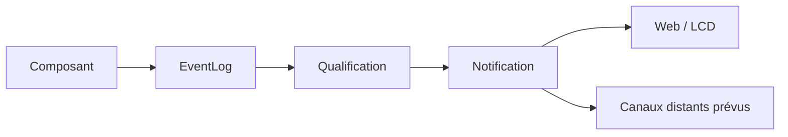

# AquaLook Engineering Reference — Notifications

- Version documentaire : 0.7
- Statut : préliminaire
- Dernière consolidation : 2026-07-27
- Sources : roadmaps notifications, EventLog, architecture cybersécurité
- Composants : futur NotificationManager, Web, MQTT, ntfy, application mobile
- Maturité : D2

## Mission

Le service de notifications diffuse vers l’utilisateur des informations issues d’événements déjà qualifiés. Il ne crée pas de décision métier et ne conditionne pas le fonctionnement du moteur d’arrosage.

## Principe

Une notification est une représentation d’un événement ; l’événement reste la source de traçabilité.

## État

Les notifications locales et les messages d’interface existent sous différentes formes historiques. Le gestionnaire multi-canal, les règles utilisateur, les accusés et les services distants restent à consolider lors de leur implémentation.

## Catégories

- information : fonctionnement normal significatif ;
- avertissement : mode dégradé ou action recommandée ;
- erreur : fonction non exécutée ;
- critique : sécurité, relais ou intégrité affectés ;
- maintenance : mise à jour, sauvegarde ou intervention nécessaire.

## Données minimales

- identifiant ;
- événement source ;
- horodatage ;
- sévérité ;
- équipement ou zone concernés ;
- message localisable ;
- canaux demandés ;
- état d’envoi ;
- expiration ;
- absence de secret.

## Interfaces exposées

Aucune URL, topic MQTT ou endpoint ntfy n’est déclaré officiel ici. Les interfaces seront ajoutées après validation du code et de la configuration.

Pour chaque canal, documenter : destination, authentification, format, limite de débit, politique de reprise, confidentialité et rétention.

## Déduplication et limitation

Les événements répétitifs doivent être regroupés ou limités afin d’éviter :

- la saturation d’un service ;
- une boucle de notification ;
- l’épuisement du stockage ou du réseau ;
- la perte de visibilité des incidents importants.

Une notification critique ne doit pas être supprimée uniquement par déduplication ; son événement source reste conservé.

## Modes dégradés

### Internet indisponible

Les canaux locaux restent disponibles. Les envois distants sont abandonnés ou mis en attente selon une politique bornée.

### Canal distant indisponible

Les autres canaux continuent. L’échec est journalisé sans créer de récursion infinie.

### Heure absolue indisponible

L’ordre relatif reste fourni par `millis()` ; les règles d’expiration dépendantes de l’heure appliquent une politique explicite.

## Sécurité

- pas de mot de passe, jeton ou clé dans le contenu ;
- destinataire explicitement configuré ;
- limitation des données personnelles ;
- canal chiffré pour les informations sensibles ;
- action depuis une notification soumise à authentification ;
- lien profond ou commande non considéré comme une autorisation.

## Invariants

### INV-NOT-001

Une notification distante n’est jamais nécessaire à l’exécution locale.

### INV-NOT-002

Chaque notification est reliée à un événement ou à une action traçable.

### INV-NOT-003

Un échec d’envoi ne bloque pas le Runtime.

### INV-NOT-004

Aucun secret réutilisable n’est inclus dans une notification.

## Validation avant passage à D3

- canaux et interfaces extraits du code ;
- déduplication et quotas testés ;
- échecs réseau testés ;
- contenus contrôlés contre les secrets ;
- acquittement et expiration testés si implémentés ;
- impact mémoire et stockage mesuré.

## Références

- `docs/engineering/10_TIME_AND_EVENTLOG.md` ;
- `docs/architecture/OBSERVABILITY.md` ;
- `docs/security/CYBERSECURITY_ARCHITECTURE.md` ;
- roadmaps notifications.

## Historique

### 0.7

Première consolidation des notifications.