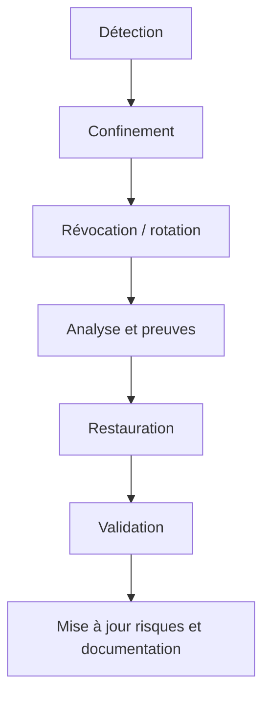

# AquaLook Engineering Reference — Exploitation cybersécurité

- Version documentaire : 1.0
- Statut : référence initiale
- Dernière consolidation : 2026-07-27
- Sources : architecture cybersécurité, registre des risques, cycle de vie sécurité
- Composants : firmware, Web, Wi-Fi, MQTT, OTA, VPS, Git, secrets
- Maturité : D3

## Objet

Ce document traduit les principes de cybersécurité en procédures d’exploitation. Il complète l’architecture sans recopier le registre des risques.

## Responsabilités d’exploitation

- inventorier les équipements, versions et identités ;
- contrôler les comptes et secrets actifs ;
- appliquer les mises à jour de sécurité ;
- surveiller les échecs d’authentification et anomalies ;
- sauvegarder et tester les restaurations ;
- révoquer un équipement ou secret compromis ;
- conserver la traçabilité des changements ;
- préparer la fin de support.

## Inventaire minimal

Pour chaque installation :

- identifiant de l’équipement ;
- matériel et révision ;
- version firmware et SHA ;
- version documentaire applicable ;
- identités Wi-Fi, MQTT et certificats ;
- propriétaire ;
- emplacement ;
- date de mise en service ;
- statut de support ;
- date de dernière revue.

## Gestion des secrets

Pour chaque secret : propriétaire, emplacement, méthode de provisionnement, durée de vie, rotation, révocation et comportement après perte.

Interdictions :

- secret dans Git ;
- secret dans une archive de checkpoint ;
- secret dans un log ;
- clé privée dans les ressources Web ou sur une SD distribuée ;
- identifiant universel partagé entre tous les appareils.

## Revues périodiques

### À chaque checkpoint

- vérifier les nouvelles interfaces ;
- réviser les risques concernés ;
- contrôler les fichiers et archives ;
- documenter les dépendances modifiées ;
- vérifier les journaux et modes dégradés.

### À chaque release

- identifier le firmware par version et SHA ;
- vérifier les artefacts ;
- revoir les secrets de publication ;
- publier les instructions de mise à jour et de repli.

### Périodiquement en exploitation

- vérifier l’expiration des certificats ;
- appliquer les correctifs VPS ;
- revoir les comptes ;
- tester une restauration ;
- contrôler les alertes de dépendances ;
- revoir les risques ouverts.

## Réponse à incident

### Actions immédiates possibles

- isoler l’équipement du réseau ;
- fermer un port ou service ;
- révoquer un certificat ou compte ;
- changer les secrets ;
- suspendre une source OTA ;
- préserver les journaux ;
- revenir à une version validée.

La mise en sécurité des relais et la continuité locale restent prioritaires.

## Gestion des vulnérabilités

Une alerte concernant une dépendance est analysée selon : composant affecté, version, exposition, exploitabilité, impact, mesure compensatoire et calendrier de correction.

Une mise à jour de bibliothèque ne doit pas être fusionnée sans compilation et tests de non-régression.

## Sauvegarde et restauration

Les sauvegardes contenant des secrets ou configurations sensibles sont protégées, inventoriées et testées. Une sauvegarde non testée ne réduit pas le risque `SEC-018`.

## Risques prioritaires

- `SEC-001` : authentification Web ;
- `SEC-003` : commandes MQTT ;
- `SEC-004` : intégrité OTA ;
- `SEC-006` : secrets dans les artefacts ;
- `SEC-008` : durcissement VPS ;
- `SEC-009` : dépendances vulnérables ;
- `SEC-017` : révocation ;
- `SEC-018` : restauration.

## Invariants

### INV-OPS-SEC-001

Un incident de service distant ne désactive pas les sécurités locales.

### INV-OPS-SEC-002

Toute compromission présumée déclenche une rotation ou révocation adaptée.

### INV-OPS-SEC-003

Un risque n’est fermé qu’après implémentation, test, documentation, observabilité et récupération.

### INV-OPS-SEC-004

Les archives de reprise excluent les secrets.

## Références

- `docs/security/CYBERSECURITY_ARCHITECTURE.md` ;
- `docs/security/SECURITY_RISK_REGISTER.md` ;
- `docs/roadmap/CYBERSECURITY_LIFECYCLE.md` ;
- `AGENTS.md`.

## Historique

### 1.0

Première consolidation des procédures de sécurité opérationnelle.