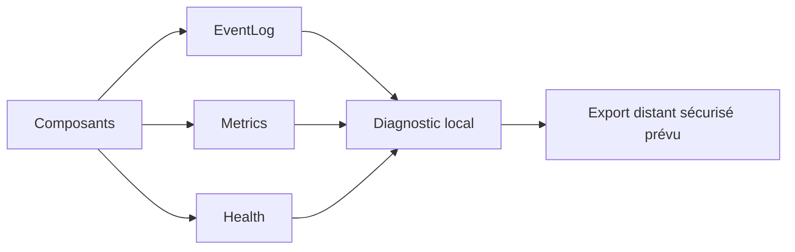

# AquaLook Engineering Reference — Diagnostic et observabilité

- Version documentaire : 1.0
- Statut : référence initiale
- Dernière consolidation : 2026-07-27
- Sources : pilier Observabilité, checkpoints Runtime et EventLog
- Composants : EventLog, profiler, diagnostics mémoire, réseau, stockage, relais
- Maturité : D3

## Mission

L’observabilité rend l’état réel d’AquaLook compréhensible sans devenir une dépendance du moteur d’arrosage.

## Types de données

- événement : changement ou incident horodaté ;
- métrique : valeur numérique avec unité et fréquence ;
- état de santé : `OK`, `DEGRADED`, `FAULT` ou `UNKNOWN` ;
- trace d’action : origine, demande, décision, exécution et résultat ;
- diagnostic : données techniques destinées à l’analyse.

## Minimum embarqué

- identité du build et uptime ;
- cause du dernier redémarrage ;
- heap libre et plus grand bloc contigu ;
- état Wi-Fi, RSSI et synchronisation temporelle ;
- état NVS, LittleFS et microSD ;
- état des relais et cycle actif ;
- erreurs récentes ;
- compteur d’incidents critiques ;
- mesures du profiler Runtime.

## EventLog

Le journal centralise les événements significatifs. Avant NTP, l’ordre relatif est fourni par `millis()`. Après synchronisation, l’heure absolue prend le relais pour les nouveaux événements. Le changement de source temporelle est traçable.

Les événements ne doivent pas contenir de secrets et la journalisation doit rester non bloquante.

## Profiler Runtime

Les mesures de l’étape 6 sont qualifiées en temps mural. Une pause peut inclure du temps d’ordonnancement et ne doit pas être attribuée automatiquement au composant actif.

`yield()` reste mesuré dans les diagnostics mais est exclu des alertes de lenteur métier. Les pauses proches de 136 ms observées sont considérées comme potentiellement liées à l’ordonnanceur tant qu’une mesure plus précise ne prouve pas une cause applicative.

## Architecture

## Interfaces exposées

Les routes HTTP réellement présentes sont inventoriées dans `09_WEB_AND_HTTP_INTERFACES.md`. Les pages ou API de diagnostic supplémentaires ne doivent être ajoutées qu’après extraction du code.

Les futurs topics MQTT de télémétrie restent préliminaires jusqu’à versionnement de leur cartographie.

## Politique de collecte

Chaque métrique documente :

- nom ;
- unité ;
- source ;
- fréquence ;
- plage attendue ;
- seuils ;
- rétention ;
- coût mémoire et CPU ;
- caractère sensible.

Les collectes et écritures sont bornées et non bloquantes.

## États inconnus et données anciennes

Une donnée non mesurée, invalide ou trop ancienne est présentée comme `UNKNOWN` ou périmée. Elle ne doit pas être affichée comme normale par défaut.

## Modes dégradés

### microSD absente

Le diagnostic local et un journal mémoire limité restent disponibles.

### réseau absent

Les mesures locales continuent ; aucun export distant n’est requis.

### stockage saturé

Une politique de rotation ou de limitation s’applique. Les événements critiques sont prioritaires.

### mémoire faible

Les fonctions d’observation réduisent leur collecte avant de compromettre le Runtime.

## Sécurité

Ne jamais journaliser : mots de passe, clés privées, jetons complets, données de session réutilisables ou secrets de publication.

Les identifiants techniques sont tronqués lorsque leur valeur complète n’est pas nécessaire.

## Invariants

### INV-OBS-001

L’observabilité ne bloque jamais le Scheduler ou la chaîne de commande.

### INV-OBS-002

Chaque métrique possède une unité, une source et une fréquence explicites.

### INV-OBS-003

Un état inconnu n’est jamais converti implicitement en état sain.

### INV-OBS-004

Les diagnostics restent partiellement accessibles sans Internet ni microSD.

### INV-OBS-005

Le résultat rapporté est cohérent avec l’effet matériel réellement observé lorsque celui-ci est disponible.

## Tests

- fonctionnement sans réseau ;
- fonctionnement sans microSD ;
- journal saturé ;
- heap faible ;
- redémarrage et conservation des incidents critiques ;
- absence de secrets ;
- cohérence EventLog / relais ;
- impact du profiler sur le Runtime.

## Références

- `docs/architecture/OBSERVABILITY.md` ;
- `docs/engineering/10_TIME_AND_EVENTLOG.md` ;
- `docs/engineering/15_RUNTIME_AND_PROFILING.md` ;
- checkpoint de clôture de l’étape 6.

## Historique

### 1.0

Première consolidation du diagnostic et de l’observabilité.